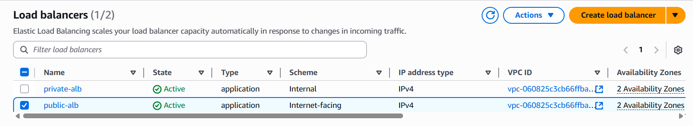
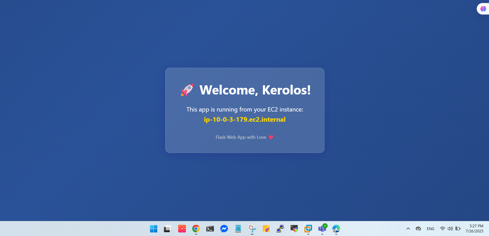

# Secure Web App with Public Proxy + Private Backend on AWS

A highly secure, scalable web application infrastructure deployed on AWS using Terraform. This project implements a multi-tier architecture with public proxies and private backend servers, ensuring optimal security and performance.

## Architecture Overview


```
Internet
    ↓
Internet Gateway
    ↓
Public ALB (Load Balancer)
    ↓
Public Subnets (2 AZs)
    ↓
Nginx Reverse Proxies (EC2)
    ↓
Internal ALB (Load Balancer)
    ↓
Private Subnets (2 AZs)
    ↓
Backend Web Servers (EC2)
    ↓
NAT Gateway → Internet Gateway
```

##  Features

- **Multi-Tier Architecture**: Separation of public-facing proxies and private backend servers
- **High Availability**: Deployed across 2 Availability Zones
- **Load Balancing**: Public and internal Application Load Balancers for traffic distribution
- **Security**: Private subnets for backend servers with NAT Gateway for outbound traffic
- **Infrastructure as Code**: Complete Terraform implementation with modular design
- **Automated Provisioning**: Remote provisioners for software installation
- **State Management**: Remote state storage in S3 bucket
- **Custom Modules**: Reusable Terraform modules for each component

##  Prerequisites

Before you begin, ensure you have the following installed and configured:

- [Terraform](https://www.terraform.io/downloads.html) (v1.0+)
- [AWS CLI](https://aws.amazon.com/cli/) configured with appropriate credentials
- AWS Account with necessary permissions
- SSH key pair for EC2 access

##  Project Structure

```
secure-webapp-terraform-aws/
├── modules/
│   ├── bastion_host/
│   │   ├── main.tf
│   │   ├── variables.tf
│   │   └── outputs.tf
│   ├── ec2-backend/
│   │   ├── main.tf
│   │   ├── variables.tf
│   │   ├── outputs.tf
│   │   └── app.py
│   ├── ec2-reverse-proxy/
│   │   ├── main.tf
│   │   ├── variables.tf
│   │   ├── outputs.tf
│   │   └── proxy_nginx.tpl
│   ├── internet_gateway/
│   │   ├── main.tf
│   │   ├── variables.tf
│   │   └── outputs.tf
│   ├── nat_gateway/
│   │   ├── main.tf
│   │   ├── variables.tf
│   │   └── outputs.tf
│   ├── private-alb/
│   │   ├── main.tf
│   │   ├── variables.tf
│   │   └── outputs.tf
│   ├── public-alb/
│   │   ├── main.tf
│   │   ├── variables.tf
│   │   └── outputs.tf
│   ├── security_groups/
│   │   ├── main.tf
│   │   ├── variables.tf
│   │   └── outputs.tf
│   ├── subnets/
│   │   ├── main.tf
│   │   ├── variables.tf
│   │   └── outputs.tf
│   ├── vpc/
│   │   ├── main.tf
│   │   ├── variables.tf
│   │   └── outputs.tf
├── main.tf
├── backend.tf
├── all-ips.txt
├── .gitignore
├── terraform.lock.hcl
└── README.md
```

##  Installation & Deployment

### Step 1: Clone the Repository

```bash
git clone https://github.com/yourusername/secure-webapp-terraform-aws.git
cd secure-webapp-terraform-aws
```

### Step 2: Configure AWS Credentials

```bash
aws configure
```

### Step 3: Initialize Terraform Workspace

```bash
# Create and switch to dev workspace
terraform workspace new dev
terraform workspace select dev
```

### Step 4: Initialize Terraform

```bash
terraform init
```

### Step 5: Plan Infrastructure

```bash
terraform plan
```

### Step 6: Deploy Infrastructure

```bash
terraform apply
```

## Configuration

### Backend Configuration

The project uses S3 for remote state storage. Configure your backend in `backend.tf`:

```hcl
terraform {
  backend "s3" {
    bucket = "your-terraform-state-bucket"
    key    = "dev/terraform.tfstate"
    region = "us-west-2"
  }
}
```

### Variables

Key variables you can customize:

| Variable | Description | Default |
|----------|-------------|---------|
| `region` | AWS region | `us-west-2` |
| `instance_type` | EC2 instance type | `t3.micro` |
| `key_name` | SSH key pair name | `your-key-pair` |
| `environment` | Environment name | `dev` |

## Modules Description

### VPC Module
Creates the Virtual Private Cloud with custom CIDR blocks, availability zones, and DNS settings.

---

### Subnets Module
- **Public Subnets**: Host the Nginx reverse proxies and NAT/Bastion instances.
- **Private Subnets**: Host the backend web servers.
  
---

### Internet Gateway (IGW) Module
Creates and attaches an Internet Gateway to the VPC to allow outbound internet access for public subnets.

---

### NAT Gateway Module
Provisioned in public subnets to allow private subnet instances to access the internet securely (for software updates, etc.) without being publicly exposed.

---

### Bastion EC2 Module
Creates a Bastion (Jumpbox) EC2 instance in a public subnet to provide SSH access to private instances securely.

---

### Security Groups Module
Configures security rules for different tiers:
- **Public ALB Security Group**: Accepts HTTP/HTTPS traffic from the internet.
- **Proxy EC2 Security Group**: Allows traffic from the public ALB and to internal ALB.
- **Internal ALB Security Group**: Accepts traffic only from proxy servers.
- **Backend EC2 Security Group**: Allows connections only from the internal ALB.
- **Bastion Security Group**: Allows SSH access only from your IP (defined in `terraform.tfvars`).

---

### Load Balancers Module
- **Public ALB**: Routes external traffic to the reverse proxy EC2 instances.
- **Internal ALB**: Routes internal traffic from the proxies to the backend servers.

---

### EC2 Modules
- **Reverse Proxy**: Nginx servers in public subnets acting as a traffic filter/gateway.
- **Backend**: Flask or Node.js app servers running in private subnets.
- **Bastion Host**: SSH jumpbox to access private EC2 instances securely.

---
## AWS Console Some Used Resources Screens
  ## EC2s
  

 ---
 
  ## Subnets
  

  ---

  ## Load Blancers
  

  ---

  ## Security Groups
  

  ---

  ## Workspace
  

  

##  Outputs

After successful deployment, you'll get:

- Public ALB DNS name
- All IP addresses written to `all-ips.txt`
- Backend server private IPs
- Proxy server public IPs
  
### Output from frist basckend ec2

  
  
  ---
  
### Output from second basckend ec2
  


##  Security Features

- **Network Isolation**: Backend servers in private subnets
- **Security Groups**: Restrictive inbound/outbound rules
- **NAT Gateway**: Secure outbound internet access for private instances
- **Load Balancer**: SSL termination and DDoS protection
- **Access Control**: SSH access through bastion host only

##  Testing

### Access the Application

1. Get the Public ALB DNS name from Terraform outputs
2. Open your browser and navigate to the ALB endpoint
3. Verify that traffic is being routed through proxies to backend servers


## Monitoring & Logging

- CloudWatch metrics for EC2 instances and load balancers
- ALB access logs stored in S3
- VPC Flow Logs for network traffic analysis

##  Best Practices Implemented

- 1- Infrastructure as Code with Terraform
- 2- Modular architecture for reusability
- 3- Remote state management
- 4- Multi-AZ deployment for high availability
- 5- Principle of least privilege for security groups
- 6- Automated provisioning with Terraform provisioners
- 7- Resource tagging for better management

##  CI/CD Integration

This project can be integrated with:
- GitHub Actions for automated deployments
- Jenkins for continuous integration
- AWS CodePipeline for native AWS CI/CD


##  Cleanup

To destroy the infrastructure:

```bash
terraform destroy
```

**⭐ If this project helped you, please give it a star ⭐**

##  Support & Contact

Feel free to reach out if you have questions, feedback, or want to collaborate on DevOps, Cloud, or Infrastructure projects:

- 👨‍💻 **Name:** Kerolos Mamdouh  
- 📍 **Location:** Cairo, Egypt  
- 📧 **Email:** [kerolosmamdouh20@gmail.com](mailto:kerolosmamdouh20@gmail.com)  
- 💼 **LinkedIn:** [linkedin.com/in/kerolos-mamdouh-90a11b26b](https://www.linkedin.com/in/kerolos-mamdouh-90a11b26b)  
- 💻 **GitHub:** [github.com/kerolos-10](https://github.com/kerolos-10)  

> I’m a **DevOps Engineer** and **RHCSA-certified System Administrator**, passionate about building infrastructure, automation, and cloud-native solutions.

